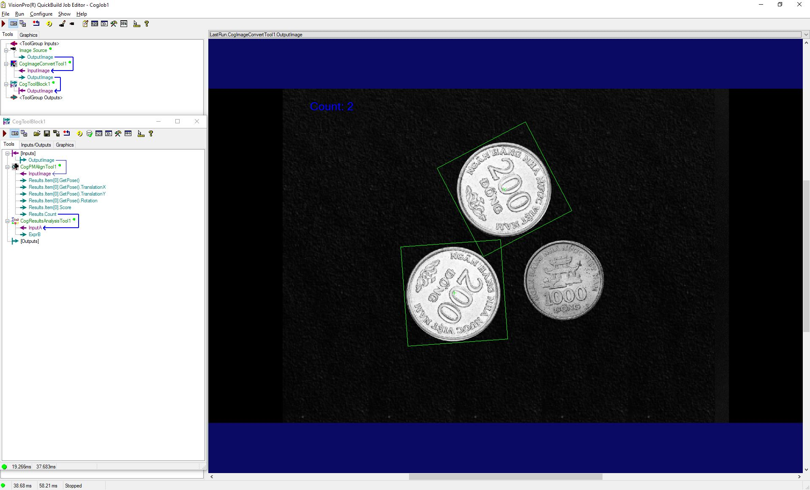

# Đếm số lượng đồng xu 200 đồng

## Image Source
Click ```Choose Folder```, chọn thư mục chứa ảnh

## CogImageConverTool

Xử lý ảnh đầu vào

## CogPMAlignTool
Nhấn ```Grab Train Image```, sau đó chọn ```Current.TrainImage``` ở list (góc trên bên phải), sau đó kéo để khoanh vùng vật thể cần detect.

Sang tab ```Train Region & Origin``` chọn ```Center Origin``` để đặt gốc trụ tọa độ vào tâm của vật thể. Sau đó nhấn ``` Train ```.

Tab ```Graphic```, tích chọn ```Show Fine```

## CogResultsAnalysisTool
Công cụ để tính toán các biểu thức toán học

## Kết quả
Đếm số lượng đồng xu 200 đồng


## Source Code show thông tin lên ảnh
```
#region namespace imports
using System;
using System.Collections;
using System.Drawing;
using System.IO;
using System.Windows.Forms;
using Cognex.VisionPro;
using Cognex.VisionPro.ToolBlock;
using Cognex.VisionPro3D;
using Cognex.VisionPro.ImageProcessing;
using Cognex.VisionPro.PMAlign;
using Cognex.VisionPro.ResultsAnalysis;
#endregion

public class CogToolBlockAdvancedScript : CogToolBlockAdvancedScriptBase
{
  #region Private Member Variables
  private Cognex.VisionPro.ToolBlock.CogToolBlock mToolBlock;
  
  CogGraphicLabel myLabel = new CogGraphicLabel();
  
  #endregion

  /// <summary>
  /// Called when the parent tool is run.
  /// Add code here to customize or replace the normal run behavior.
  /// </summary>
  /// <param name="message">Sets the Message in the tool's RunStatus.</param>
  /// <param name="result">Sets the Result in the tool's RunStatus</param>
  /// <returns>True if the tool should run normally,
  ///          False if GroupRun customizes run behavior</returns>
  public override bool GroupRun(ref string message, ref CogToolResultConstants result)
  {
    // To let the execution stop in this script when a debugger is attached, uncomment the following lines.
    // #if DEBUG
    // if (System.Diagnostics.Debugger.IsAttached) System.Diagnostics.Debugger.Break();
    // #endif


    // Run each tool using the RunTool function
    foreach(ICogTool tool in mToolBlock.Tools)
      mToolBlock.RunTool(tool, ref message, ref result);
    
    CogPMAlignTool count = mToolBlock.Tools["CogPMAlignTool1"] as CogPMAlignTool;
    myLabel.SetXYText(400, 70, "Count: " + count.Results.Count.ToString("F0"));
    
    myLabel.Color = CogColorConstants.Blue;
    myLabel.Font = new Font("Cambrial", 20);
    
    return false;
  }

  #region When the Current Run Record is Created
  /// <summary>
  /// Called when the current record may have changed and is being reconstructed
  /// </summary>
  /// <param name="currentRecord">
  /// The new currentRecord is available to be initialized or customized.</param>
  public override void ModifyCurrentRunRecord(Cognex.VisionPro.ICogRecord currentRecord)
  {
  }
  #endregion

  #region When the Last Run Record is Created
  /// <summary>
  /// Called when the last run record may have changed and is being reconstructed
  /// </summary>
  /// <param name="lastRecord">
  /// The new last run record is available to be initialized or customized.</param>
  public override void ModifyLastRunRecord(Cognex.VisionPro.ICogRecord lastRecord)
  {
    mToolBlock.AddGraphicToRunRecord(myLabel, lastRecord, "CogPMAlignTool1.InputImage", "");
  }
  #endregion

  #region When the Script is Initialized
  /// <summary>
  /// Perform any initialization required by your script here
  /// </summary>
  /// <param name="host">The host tool</param>
  public override void Initialize(Cognex.VisionPro.ToolGroup.CogToolGroup host)
  {
    // DO NOT REMOVE - Call the base class implementation first - DO NOT REMOVE
    base.Initialize(host);


    // Store a local copy of the script host
    this.mToolBlock = ((Cognex.VisionPro.ToolBlock.CogToolBlock)(host));
  }
  #endregion

}


```
