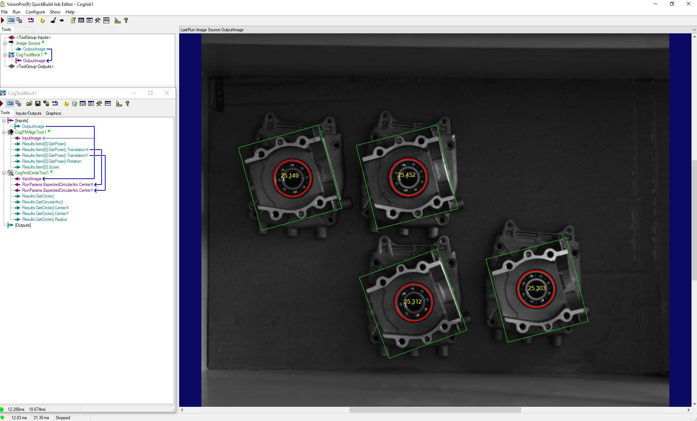

# Detect Multi Object

## Kết quả
Kết quả phát hiện các vật thể trong khung ảnh, khoanh vùng hình tròn và đo bán kính của hình các hình tròn thuộc các vật thể đã được detect.



## Script Code
```
#region namespace imports
using System;
using System.Collections;
using System.Drawing;
using System.IO;
using System.Windows.Forms;
using Cognex.VisionPro;
using Cognex.VisionPro.ToolBlock;
using Cognex.VisionPro3D;
using Cognex.VisionPro.PMAlign;
using Cognex.VisionPro.Caliper;

using System.Collections.Generic;
#endregion

public class CogToolBlockAdvancedScript : CogToolBlockAdvancedScriptBase
{
  #region Private Member Variables
  private Cognex.VisionPro.ToolBlock.CogToolBlock mToolBlock;
  #endregion

  /// <summary>
  /// Called when the parent tool is run.
  /// Add code here to customize or replace the normal run behavior.
  /// </summary>
  /// <param name="message">Sets the Message in the tool's RunStatus.</param>
  /// <param name="result">Sets the Result in the tool's RunStatus</param>
  /// <returns>True if the tool should run normally,
  ///          False if GroupRun customizes run behavior</returns>
  
  ArrayList arr1 = new ArrayList();
  ArrayList arr2 = new ArrayList();
  public override bool GroupRun(ref string message, ref CogToolResultConstants result)
  {
    // To let the execution stop in this script when a debugger is attached, uncomment the following lines.
    // #if DEBUG
    // if (System.Diagnostics.Debugger.IsAttached) System.Diagnostics.Debugger.Break();
    // #endif


    // Run each tool using the RunTool function
    foreach(ICogTool tool in mToolBlock.Tools)
      mToolBlock.RunTool(tool, ref message, ref result);
    
    arr1.Clear(); arr2.Clear();
    CogPMAlignTool tmp = mToolBlock.Tools["CogPMAlignTool1"] as CogPMAlignTool;
    CogFindCircleTool fc = mToolBlock.Tools["CogFindCircleTool1"] as CogFindCircleTool;
    foreach (CogPMAlignResult item in tmp.Results){
      fc.RunParams.ExpectedCircularArc.CenterX = item.GetPose().TranslationX;
      fc.RunParams.ExpectedCircularArc.CenterY = item.GetPose().TranslationY;
      fc.Run();
      
      CogGraphicLabel myLabel = new CogGraphicLabel();
      myLabel.SetXYText(item.GetPose().TranslationX, item.GetPose().TranslationY, fc.Results.GetCircle().Radius.ToString("F3"));
      myLabel.Color = CogColorConstants.Yellow;
      myLabel.Font = new Font("Cambrial", 12);
      arr1.Add(myLabel);
      
      CogCircle myCircle = fc.Results.GetCircle();
      myCircle.Color = CogColorConstants.Red;
      myCircle.LineWidthInScreenPixels = 3;
      arr2.Add(myCircle);
      
    }
    
    
    return false;
  }

  
  #region When the Current Run Record is Created
  /// <summary>
  /// Called when the current record may have changed and is being reconstructed
  /// </summary>
  /// <param name="currentRecord">
  /// The new currentRecord is available to be initialized or customized.</param>
  public override void ModifyCurrentRunRecord(Cognex.VisionPro.ICogRecord currentRecord)
  {
  }
  #endregion

  #region When the Last Run Record is Created
  /// <summary>
  /// Called when the last run record may have changed and is being reconstructed
  /// </summary>
  /// <param name="lastRecord">
  /// The new last run record is available to be initialized or customized.</param>
  public override void ModifyLastRunRecord(Cognex.VisionPro.ICogRecord lastRecord)
  {
    //base.ModifyCurrentRunRecord(lastRecord);
    //CogToolBlock tb = new CogToolBlock();
    foreach (CogGraphicLabel item in arr1){
      mToolBlock.AddGraphicToRunRecord(item, lastRecord, "CogPMAlignTool1.InputImage", "");
    }
    foreach (CogCircle item in arr2){
      mToolBlock.AddGraphicToRunRecord(item, lastRecord, "CogPMAlignTool1.InputImage", "");
    }
  }
  #endregion

  #region When the Script is Initialized
  /// <summary>
  /// Perform any initialization required by your script here
  /// </summary>
  /// <param name="host">The host tool</param>
  public override void Initialize(Cognex.VisionPro.ToolGroup.CogToolGroup host)
  {
    // DO NOT REMOVE - Call the base class implementation first - DO NOT REMOVE
    base.Initialize(host);


    // Store a local copy of the script host
    this.mToolBlock = ((Cognex.VisionPro.ToolBlock.CogToolBlock)(host));
  }
  #endregion

}


```
